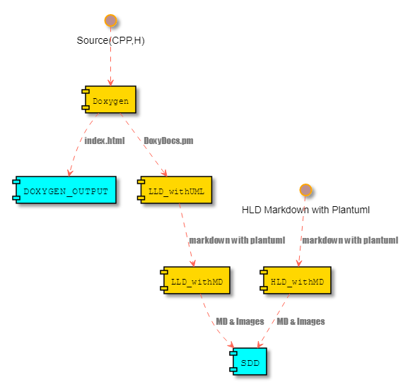
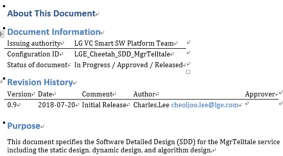
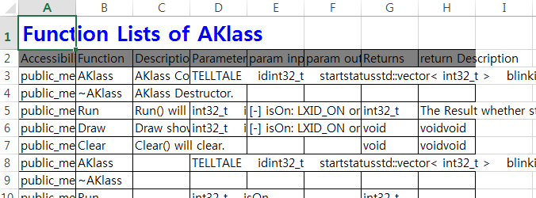
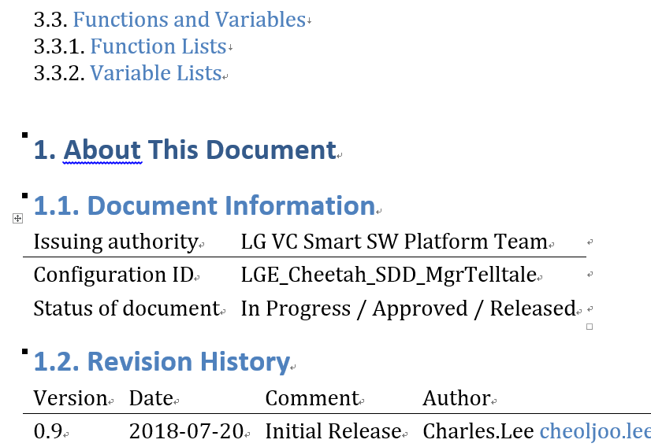

```
    ___   ___    __      ____   _____  _  _  _  _   ___  ____  _  _
   / __) / __)  /__\    (  _ \ (  _  )( \/ )( \/ ) / __)( ___)( \( )
  ( (__ ( (_-. /(__)\    )(_) ) )(_)(  )  (  \  / ( (_-. )__)  )  (
   \___) \___/(__)(__)  (____/ (_____)(_/\_) (__)  \___/(____)(_)\_)
```

# About CGADOXYGEN
- Doxygen PERLMOD to Markdown & Word & Excel converter for supporting ASPICE
    - It is helpful to make a documents from source code and your doxygen comments.
    - It is helper of doxygen.

## Purpose
- Reduce the tedious jobs (LLD : Low level Design documents). When we make a document for customer , we should make a markdown & word & excel documents with detailed class information.
- and I hop it is helpful to save your time for your life.
    - Some customer Wants
        - want detailed documents like LLD (Low Level Design).
        - LLD should include the detailed information for Class and your source code.
    - Deliverables
        - upport word and xlsx file for detailed documents.

## Backgrounds
- Doxygen comments is the best method as a good programmer
- Always synchronize source and documents
- Doxygen gives some warning to you when your comments mismatch with your code.
    - it is helpful for us to make a better source and comments (documents)
- I think that doxygen is a de facto standard in open source.
- It gives improving your international skills.

# How to Run
- How to make a document (LLD & SDD) automatically
- If you have unsolved problems in installing tools , show "How to install tools" of  https://github.com/cheoljoo/CGADoxygen/blob/master/reference/README.md

## make a documents automatically
- sh run.sh  { lists of directories including your codes (cpp and h) }
    - ex) if you have sources in ../.. ../../inc /home/user/src   , then  
    ```bash
    $ sh run.sh ../..  ../../inc  /home/user/src
    ```
    - directory list is not recursive
        - you can verify in ./CGADoxygen/build_doxygen/src as soft-link files.
- OUTPUT will be generated in "[git repository directory]/build_perlmod/OUTPUT"
    - LLD.css.html LLD.md 
## example
```
    $ sh run.sh example/A
    or 
    $ sh run.sh example/B
```

## clean
```
    $ sh run.sh clean
```

# What is the result
- Architecture
    - 
- Deliverables (SDD Component)
    - HLD Documents (HLD.md HLD.docx) : High Level Design from HLD.plantuml.md
        - 
    - LLD Documents (LLD.md LLD.docx LLD.xlsx) : Low Level Design generated from doxygen comments automatically
        - 
        - 
    - SDD Documents (SDD.md SDD.docx) : It is final result combined with HLD and LLD
        - 
- [screenshot](https://github.com/cheoljoo/CGADoxygen/tree/master/PNG)

