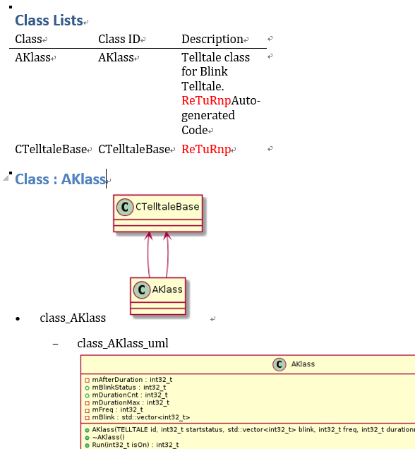

1\.  [About CGADOXYGEN](#aboutcgadoxygen)  
1.1\.  [Purpose](#purpose)  
1.2\.  [Backgrounds](#backgrounds)  
2\.  [Environment of Development](#environmentofdevelopment)  
2.1\.  [Prerequisition](#prerequisition)  
2.2\.  [docker to make an environment easily](#dockertomakeanenvironmenteasily)  
3\.  [How to Run](#howtorun)  
3.1\.  [make a documents automatically](#makeadocumentsautomatically)  
3.1.1\.  [If you have unsolved problems in installing tools](#ifyouhaveunsolvedproblemsininstallingtools)  
3.2\.  [example](#example)  
3.3\.  [clean](#clean)  
4\.  [Docker](#docker)  
4.1\.  [How to use docker in detail](#howtousedockerindetail)  
5\.  [What is the result](#whatistheresult)  

```
    ___   ___    __      ____   _____  _  _  _  _   ___  ____  _  _
   / __) / __)  /__\    (  _ \ (  _  )( \/ )( \/ ) / __)( ___)( \( )
  ( (__ ( (_-. /(__)\    )(_) ) )(_)(  )  (  \  / ( (_-. )__)  )  (
   \___) \___/(__)(__)  (____/ (_____)(_/\_) (__)  \___/(____)(_)\_)
```

<a name="aboutcgadoxygen"></a>

# 1\. About CGADOXYGEN
- Doxygen PERLMOD to Markdown & Word & Excel converter for supporting ASPICE
    - It is helpful to make a documents from source code and your doxygen comments.
    - It is helper of doxygen.

<a name="purpose"></a>

## 1.1\. Purpose
- Reduce the tedious jobs (LLD : Low level Design documents). When we make a document for customer , we should make a markdown & word & excel documents with detailed class information.
- and I hop it is helpful to save your time for your life.
    - Some customer Wants
        - want detailed documents like LLD (Low Level Design).
        - LLD should include the detailed information for Class and your source code.
    - Deliverables
        - upport word and xlsx file for detailed documents.

<a name="backgrounds"></a>

## 1.2\. Backgrounds
- Doxygen comments is the best method as a good programmer
- Always synchronize source and documents
- Doxygen gives some warning to you when your comments mismatch with your code.
    - it is helpful for us to make a better source and comments (documents)
- I think that doxygen is a de facto standard in open source.
- It gives improving your international skills.

<a name="environmentofdevelopment"></a>

# 2\. Environment of Development
<a name="prerequisition"></a>

## 2.1\. Prerequisition
- ubuntu package : python-dev python-pip python-setuptools javacc java-common pandoc doxygen vim python3-pip python3-setuptools graphviz 
- perl module ( Excel::Writer::XLSX )
	- cpan Excel::Writer::XLSX
- [hpp2plantuml](https://github.com/thibaultmarin/hpp2plantuml)
- [markdown-pp](https://github.com/jreese/markdown-pp)

<a name="dockertomakeanenvironmenteasily"></a>

## 2.2\. docker to make an environment easily
- docker pull cheoljoo/ubuntu16:cgadoxygen
	- [Command](https://github.com/cheoljoo/CGADoxygen/blob/master/docker.md#docker-environment-from-dockerhub)

<a name="howtorun"></a>

# 3\. How to Run
- How to make a document (LLD & SDD) automatically

<a name="makeadocumentsautomatically"></a>

## 3.1\. make a documents automatically
- (optional) if you have many subdirectories , you try to run copy.sh at first.
    - sh copy.sh [SOURCE DIRECTORY] [DESTINATION STORAGE Name] 
        ```bash
        sh copy.sh ../../OUTPUT/stc  ./src
        ```
- sh run.sh  { lists of directories including your codes (cpp and h) }
    - if you run copy.sh  (destination : ./src)
        ```bash
        $ sh run.sh ./src
        ```
    - ex) if you have sources in ../..  ../../inc  /home/user/src   , then  
        ```bash
        $ sh run.sh ../..  ../../inc  /home/user/src
        ```
    - directory list is not recursive
        - you can verify in ./CGADoxygen/build_doxygen/src as soft-link files.
- OUTPUT will be generated in "[git repository directory]/build_perlmod/OUTPUT"
    - LLD (Low Level Design) Document : it is full document
    - NECE (Necessary) LLD : it is necessary document. I remove the doc when they do not have doxygen comments.
    - SEQU (Sequential) LLD : it solves the detailed information each function sequentially.  it will support multiple plantuml and note and details.

|  OUTPUT  |  HTML  |  Markdown |
|:--------:|:-------|:----------|
|Low Level Design (LLD) | LLD.css.html |  LLD.md  |
| NECE (Necessary) LLD |nece.css.html |  nece.html.md  |
| SEQU (Sequential) LLD | sequ.css.html |  sequ.html.md  |

<a name="ifyouhaveunsolvedproblemsininstallingtools"></a>

### 3.1.1\. If you have unsolved problems in installing tools 
- Show "How to install tools" of  https://github.com/cheoljoo/CGADoxygen/blob/master/reference/README.md

<a name="example"></a>

## 3.2\. example
```bash
    $ sh run.sh ./example/A  ./exampleC   ./exampleD/Source
    or 
    $ sh run.sh example/B
```

<a name="clean"></a>

## 3.3\. clean
```bash
    $ sh run.sh clean
```

<a name="docker"></a>

# 4\. Docker
<a name="howtousedockerindetail"></a>

## 4.1\. How to use docker in detail
- [Docker Environment in detail](docker.md)
- docker image pull
    - $ docker pull cheoljoo/ubuntu16:cgadoxygen
    - $ docker run -it -v /home/username/doxygen:/docker --name cga1 cheoljoo/ubuntu16:cgadoxygen  /bin/bash
        - /home/username/doxygen  : is your host directory to use for your code
        - /docker : is directory in docker shell
- [docker shell]
    - $ cd /docker
    - $ sudo python3 setup.py install   (after git clone hpp2plantuml if hpp2plantuml is not working well.)

<a name="whatistheresult"></a>

# 5\. What is the result
- Architecture
    - 
- Deliverables (SDD Component)
    - HLD Documents (HLD.md HLD.docx) : High Level Design from HLD.plantuml.md
        - 
    - LLD Documents (LLD.md LLD.docx LLD.xlsx) : Low Level Design generated from doxygen comments automatically
        - 
        - 
    - SDD Documents (SDD.md SDD.docx) : It is final result combined with HLD and LLD
        - 
- [screenshot](https://github.com/cheoljoo/CGADoxygen/tree/master/PNG)

