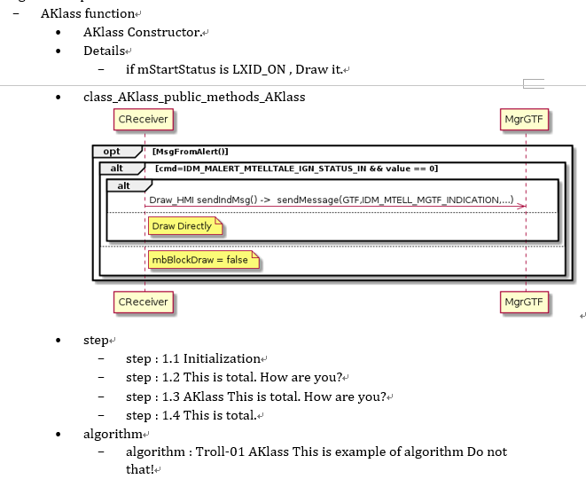
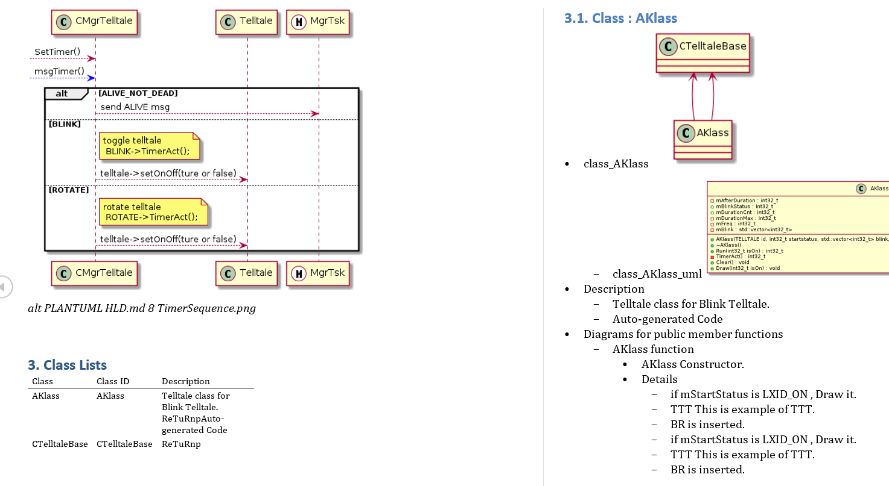
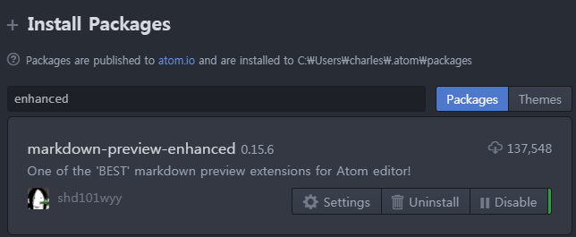
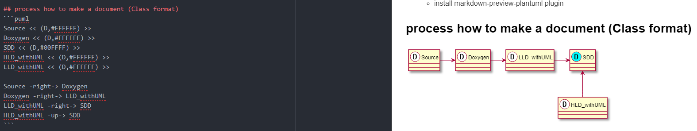
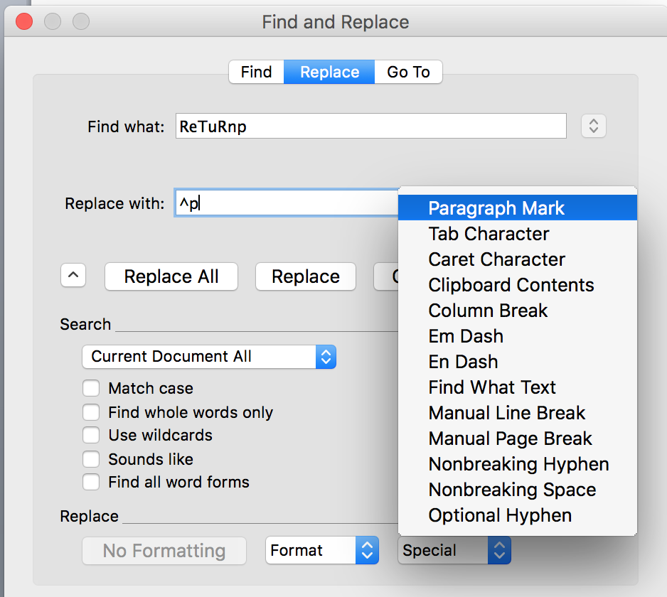
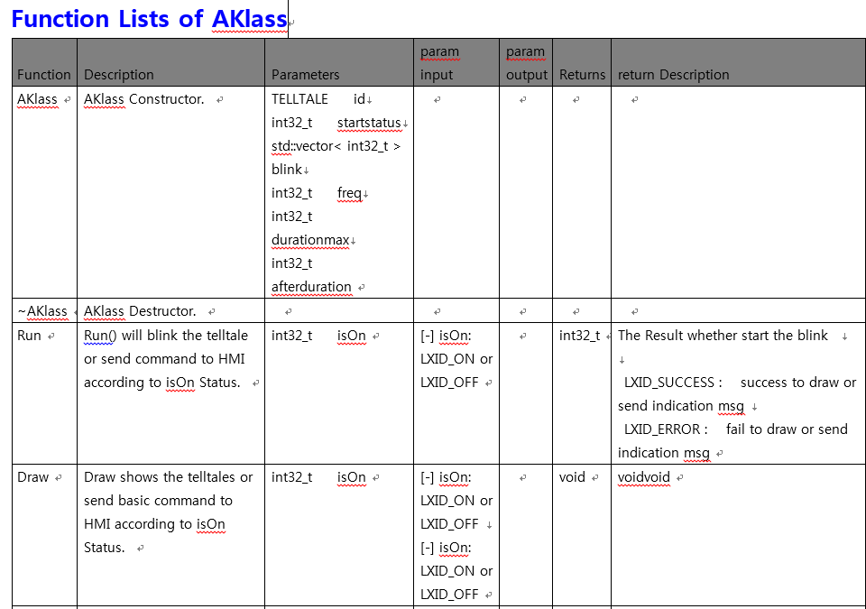
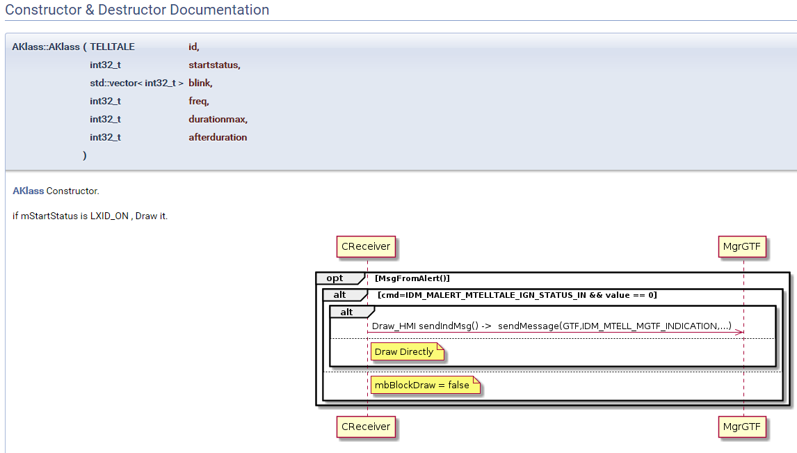
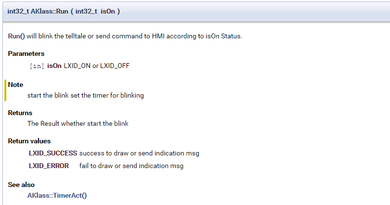
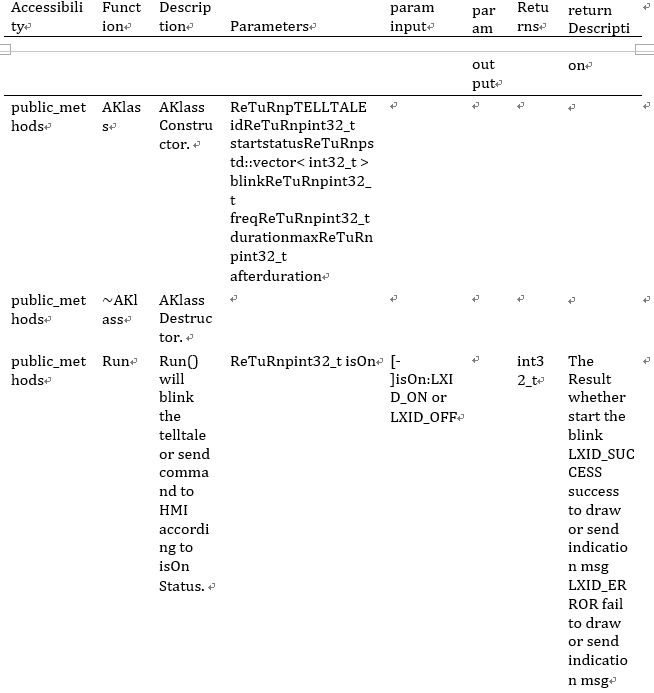
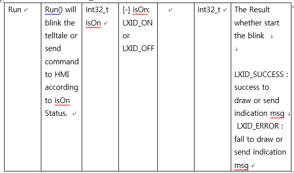

```
  _____    _____                _____
 / ____|  / ____|     /\       |  __ \
| |      | |  __     /  \      | |  | |   ___   __  __  _   _    __ _    ___   _ __
| |      | | |_ |   / /\ \     | |  | |  / _ \  \ \/ / | | | |  / _` |  / _ \ | '_ \
| |____  | |__| |  / ____ \    | |__| | | (_) |  >  <  | |_| | | (_| | |  __/ | | | |
 \_____|  \_____| /_/    \_\   |_____/   \___/  /_/\_\  \__, |  \__, |  \___| |_| |_|
                                                         __/ |   __/ |
                                                        |___/   |___/


    ___   ___    __      ____   _____  _  _  _  _   ___  ____  _  _
   / __) / __)  /__\    (  _ \ (  _  )( \/ )( \/ ) / __)( ___)( \( )
  ( (__ ( (_-. /(__)\    )(_) ) )(_)(  )  (  \  / ( (_-. )__)  )  (
   \___) \___/(__)(__)  (____/ (_____)(_/\_) (__)  \___/(____)(_)\_)


 ___    ___    _____     ___                                            
(  _`\ (  _`\ (  _  )   (  _`\                                          
| ( (_)| ( (_)| (_) |   | | ) |   _          _   _    __     __    ___  
| |  _ | |___ |  _  |   | | | ) /'_`\ (`\/')( ) ( ) /'_ `\ /'__`\/' _ `\
| (_( )| (_, )| | | |   | |_) |( (_) ) >  < | (_) |( (_) |(  ___/| ( ) |
(____/'(____/'(_) (_)   (____/'`\___/'(_/\_)`\__, |`\__  |`\____)(_) (_)
                                            ( )_| |( )_) |              
                                            `\___/' \___/'              


 __   __           __   __           __   ___      
/  ` / _`  /\     |  \ /  \ \_/ \ / / _` |__  |\ |
\__, \__> /~~\    |__/ \__/ / \  |  \__> |___ | \|


```
# About CGADOXYGEN
- CGADOXYGEN : Code Generator Automatically based on DOXYGEN Documents
    - It is helpful to make a documents from source code and your doxygen comments.
    - It is helper of doxygen.

## Purpose
- Reduce the tedious jobs (LLD : Low level Design documents). When we make a document for customer , we should make a word documents with detailed class information.
- So I made this project to reduce this job. I hope you use your time for valuable things.
- and I wish it is helpful to save your time for your life.
    - Some customer Wants
        - want detailed documents like LLD (Low Level Design).
        - LLD should include the detailed information for Class and your source code.
    - Deliverables
        - upport word and xlsx file for detailed documents.

## Backgrounds
- Doxygen comments is the best method as a good programmer
- Always synchronize source and documents
- Doxygen gives some warning to you when your comments mismatch with your code.
    - it is helpful for us to make a better source and comments (documents)
- I think that doxygen is a de facto standard in open source.
- It gives improving your international skills.

## Architecture
- 

## Devliverables
### LLD Document (Detailed Class and Source information)
- LLD.docx : Detailed Class and Source document
    - 
- LLD.xlsx : Excel file to have tables for each class
    - 

### SDD Document
- SDD.docx  : It is final result combined with HLD and LLD
    - 
    - **Change the "ReTuRnp" to Paragraph Mark** in Word for getting complete documents


# How to get
- Source
    1. CGADOXYGEN.tar.gz
    - Mgr$  tar xvfo CGADOXYGEN.tar.gz
        - unzip CGADOXYGEN.tar.gz in Your project
        - Your project name and direcotry : ./Mgr
        - unzip location : ./Mgr/CGADOXYGEN
    2. git clone URL  <- support in the future

# How to make an environtment
## How to install tools
- you should use **doxygen version 1.8.15 or more.**
- cd ./CGADOXYGEN/tools
- Automatic Install
    - sh setting_env.sh
- Manual Install
    - Basic tools
        - sudo apt install sudo build-essential wget python-dev git pandoc
    - Setuptools for hpp2plantuml
        - tar xvfz setuptools-40.0.0.tar.gz
        - cd setuptools-40.0.0 ; sudo python3 setup.py install
        - or user mdoe install -> cd setuptools-40.0.0 ; python3 setup.py install --user  (add ~/.local/bin in $PATH)
    - hpp2plantuml
        - tar xvfz hpp2plantuml.tar.gz
        - cd hpp2plantuml ; sudo python3 setup.py install
        - or user mode install -> cd hpp2plantuml ; python3 setup.py install --user   (add ~/.local/bin in $PATH)
    - Markdown-pp
        - tar xvfz markdown-pp.tar.gz
        - cd markdown-pp ; python setup.py install --user
        - (It will install  in ~/.local/bin)
    - XLSX packet for perl (Method 1)
        - cd ./XLSX
        - tar xvfz perl5.tar.gz
        - cp -r ./perl5 ~/
        - add environment variables  (Recommendation : modify by yourself)
        - cat ./perl5.bashrc >> ~/.bashrc
    - XLSX packet for perl (Method 2)
        - reference URL
            - http://search.cpan.org/~jmcnamara/Excel-Writer-XLSX/lib/Excel/Writer/XLSX.pm
            - https://metacpan.org/pod/Excel::Writer::XLSX
        - $ cpan
            - [all yes]
            - cpan[1]> install Excel::Writer::XLSX

## vim tools to insert doxygen comments
- cp ./CGADOXYGEN/tools/vim/DoxygenToolkit.vim ~/.vim/plugin
- add contents in .vimrc

```
let g:DoxygenToolkit_briefTag_pre="@Synopsis  "
let g:DoxygenToolkit_paramTag_pre="@Param "
let g:DoxygenToolkit_returnTag="@Returns   "
let g:DoxygenToolkit_blockHeader="--------------------------------------------"
let g:DoxygenToolkit_blockFooter="--------------------------------------------"
let g:DoxygenToolkit_authorName="Your Name"
let g:DoxygenToolkit_licenseTag="My own license"   <-- !!! Does not end with "\<enter>"
```

- Show the following result when you type :Dox in command mode on the proper function.
    - ex) AKlass::AKlass(TELLTALE id , int32_t startstatus, std::vector<int32_t> blink , int32_t freq , int32_t durationmax , int32_t afterduration)
    - the Result on :Dox in command mode

```
/**
 * @brief
 *
 * @param id
 * @param startstatus
 * @param blink
 * @param freq
 * @param durationmax
 * @param afterduration
 */
 AKlass::AKlass(TELLTALE id , int32_t startstatus, std::vector<int32_t> blink , int32_t freq , int32_t durationmax , int32_t afterduration)
```

> Another example with return type
```
/**
 * @brief
 *
 * @param isOn
 *
 * @return
 */
int32_t AKlass::Run(int32_t isOn)
```

## Caution!!! Keep the following order when write doxygen comments
- Keep the following ORDER
    - @brief
    - @details
    - @startuml   (plantuml)
    - @step
    - @algorithm

## markdown tools to show plantuml
- Use ATOM or Visual Studio Code to show the following plantuml
    - install markdown-preview-plantuml plugin
    - 
    - 

# Set before making a documents
- Doxygen Setting : (Doxyfile)
    - File name : ./CGADOXYGEN/build_doxygen/Doxyfile
        - **PROJECT_NAME = "Your Own Project Name"**
        - **EXAMPLE_PATH = Your_Base_Directory_of_your_source_code_for_snippet**
            > Source Location for code snippet
- makefile
    - File name : ./CGADOXYGEN/makefile
        - sh makeSrcLink.sh   { lists of your codes (cpp and h) }
        - example : sh makeSrcLink.sh .. ../inc    
            <- source codes exist ../   directory
            <- header codes exist ../inc  directory
- HLD.plantuml.md
    - This is your doucment for HLD.
- SDD.mdpp
    - You can add another md files.


```
\! TOC                          <- Table of Contents

\! INCLUDE    "HLD.md"          <- HLD file
\! INCLUDE    "LLD.md"          <- LLD file which was generated automatically

You can add several md files.
```

# How to make a document automatically
## make a documents automatically
- Easy method
    - cd ./CGADOXYGEN;  **make**

## make a documents Manually (Verify each step)
- sh makeSrcLink.sh   { lists of your codes (cpp and h) }
- cd ./CGADOXYGEN/build_doxygen; make    <-  make doxygen Documents
    - Show the result in ./CGADOXYGEN/build_doxygen/DOXYGEN_OUT/html/index.html
- cd ./CGADOXYGEN/build_uml; make        <- plantuml class files
    - Show the result in ./CGADOXYGEN/build_uml/UML
    - UML  : class files and uml files of plantuml
- cd ./CGADOXYGEN/build_perlmod; make    <- make SDD documents
    - Show the result in build_perlmod
        - HLD.docx  : High level design from HLD.plantuml.md
        - LLD.docx  : Low level design generated from doxygen comments automatically
        - SDD.docx  : Combined document with HLD and LLD

## clean
- cd ./CGADOXYGEN;  **make clean**
    - You can clean in each directory with the same command.
    - ex) cd build_doxygen; make clean

# Remove the doxygen warning when you run doxygen
- You should remove warning like the following ...
    - warning: no matching class member found for
```
/home/cheoljoo/code/common_telltale/GP/Apps/Src/MgrTelltale/CGADOXYGEN/build_doxygen/old/ISmsReceiveCallback.cpp:219:
warning: no matching class member found for
android::status_t BnSmsReceiveCallback::OnTransact(uint32_t code, const Parcel &data, Parcel *reply, uint32_t flags)
  Possible candidates:
  virtual android::status_t BnSmsReceiveCallback::OnTransact(uint32_t code, const android::Parcel &data, android::Parcel *reply, uint32_t flags=0)
  virtual android::status_t BnSmsReceiveCallback::OnTransact(uint32_t code, const android::Parcel &data, android::Parcel *reply, uint32_t flags=0)
```
    - warning: argument 'bytes' of command @param is not found in the argument list
```
Generating docs for compound BpSmsReceiveCallback...
/home/cheoljoo/code/common_telltale/GP/Apps/Src/MgrTelltale/CGADOXYGEN/build_doxygen/old/ISmsReceiveCallback.cpp:179:
warning: argument 'bytes' of command @param is not found in the argument list of BpSmsReceiveCallback::OnTextMessageReceived(const char *text, const char
*origAddr, const int32_t slotId)
/home/cheoljoo/code/common_telltale/GP/Apps/Src/MgrTelltale/CGADOXYGEN/build_doxygen/old/ISmsReceiveCallback.cpp:179:
warning: argument 'length' of command @param is not found in the argument list of BpSmsReceiveCallback::OnTextMessageReceived(const char *text, const char
*origAddr, const int32_t slotId)
/home/cheoljoo/code/common_telltale/GP/Apps/Src/MgrTelltale/CGADOXYGEN/build_doxygen/old/ISmsReceiveCallback.cpp:189:
warning: The following parameters of BpSmsReceiveCallback::OnTextMessageReceived(const char *text, const char
*origAddr, const int32_t slotId) are not documented:
  parameter 'text'
```

# What is the result
- Architecture
- 
- Deliverables (SDD Component)
- HLD.docx  : High level design from HLD.plantuml.md
    - 
- LLD.docx  : Low level design generated from doxygen comments automatically
    - 
- SDD.docx  : It is final result combined with HLD and LLD
    - 
    - **Change the "ReTuRnp" to Paragraph Mark** in Word for getting complete documents
        - 
        - 
- LLD.xlsx : Excel file to have tables.
    - Depends on your style whatever you use  between SDD.docx and SDD.xlsx
    - 
    - copy & paste the excel tables into word
    - 

## Detailed Description how to convert
### Caution!!!
- Keep the following ORDER
    - @brief
    - @details
    - @startuml   (plantuml)
    - @step
    - @algorithm


### AKlass Constructor
```
/**
 * @brief AKlass Constructor
 * @details if mStartStatus is LXID_ON , Draw it.
 *
 * @startuml
 * participant CReceiver
 * opt MsgFromAlert()
 *  alt cmd=IDM_MALERT_MTELLTALE_IGN_STATUS_IN && value == 0
 *     alt
 *            CReceiver ->> MgrGTF : Draw_HMI sendIndMsg() ->  sendMessage(GTF,IDM_MTELL_MGTF_INDICATION,...)
 *      else
 *          note right CReceiver : Draw Directly
 *      end
 *  else
 *      note right CReceiver : mbBlockDraw = false
 *  end
 * end
 * @enduml
 *
 * @SRS{ABCD1 , Do it by yourself.}
 *
 * @HLD{"ABCD2","Do it by yourself."}
 *
 * @LLD{ABCD3,Do it by yourself.}
 *
 * @step 1.1 Initialization
 * @step 1.2 This is total.
 *      <br>How are you?
 * @step 1.3 AKlass This is total.
 *      How are you?
 *
 * @step 1.4 This is total.
 *
 *
 * @algorithm Troll-01  AKlass This is example of algorithm
 *      Do not that!
 *
 * @code{.cpp}  Title:AKlass-011
 *  mId = id;
    mType = BLINK_TELLTALE;
    for( std::vector<int32_t>::iterator vit = blink.begin() ; vit != blink.end() ; vit++){
        CDebug::GetInstance()->DebugPrint(DEBUG_REPETITION,"DEBUG:" "    : blink(%d) %s\n",*vit,getStringLXID((TELLTALE) *vit));
    }
 * @endcode
 *
 * @verbatim  Title:AKlass-02
    mVerbatim = BLINK_TELLTALE;
    for( std::vector<int32_t>::iterator vit = blink.begin() ; vit != blink.end() ; vit++){
    }
 * @endverbatim
 *
 * @snippet src/AKlass.h AK_TIME
 *
 * @warning AK_Warning Message
 */
AKlass::AKlass(TELLTALE id , int32_t startstatus, std::vector<int32_t> blink , int32_t freq , int32_t durationmax , int32_t afterduration)
```

- Doxygen
    - 
    - 
    - 
- Word
    - 

### AKlass Run()
```
/**
 * @brief Run() will blink the telltale or send command to HMI according to isOn Status.
 * @param [in] isOn LXID_ON or LXID_OFF
 * @note    start the blink
 *          set the timer for blinking
 * @return The Result whether start the blink
 * @retval LXID_SUCCESS success to draw or send indication msg
 * @retval LXID_ERROR fail to draw or send indication msg
 * @see AKlass::TimerAct()
 */
int32_t AKlass::Run(int32_t isOn)
```

- Doxygen
    - 
- Word
    - 
    - 
- Excel
    - 

# FAQ
## Converting tools into word
- pandoc : markdown to Word
- ATOM Editor : save as html then read html file in word

## What is ReTuRnp?  How to remove it?
- 
- **Change the "ReTuRnp" to Paragraph Mark** in Word for getting complete documents
    - 
    - 

# Bonus
## insert static_cast<...> easily for MISRA

# plantuml
- Use ATOM or Visual Studio Code to show the following plantuml
- install markdown-preview-plantuml plugin

## process how to make a document (Class format)
```puml
Source << (D,#FFFFFF) >>
Doxygen << (D,#FFFFFF) >>
SDD << (D,#00FFFF) >>
HLD_withUML << (D,#FFFFFF) >>
LLD_withUML << (D,#FFFFFF) >>

Source -right-> Doxygen
Doxygen -right-> LLD_withUML
LLD_withUML -right-> SDD
HLD_withUML -up-> SDD
```

## process how to make a document (Component format)

```puml
component [SDD_withSRS] #00FFFF
component [DOXYGEN_OUTPUT] #00FFFF
component [Excel] #00FFFF
component [LLD_withUML] #00FFFF
component [LLD_withMD_SRS] #00FFFF

skinparam interface {
  backgroundColor RosyBrown
  borderColor orange
}

skinparam component {
  FontSize 13
  BackgroundColor<<Apache>> Red
  BorderColor<<Apache>> #FF6655
  FontName Courier
  BorderColor black
  BackgroundColor gold
  ArrowFontName Impact
  ArrowColor #FF6655
  ArrowFontColor #777777
}

() "Source(CPP,H,SRS)" as Source
() "Source(HLD Markdown with Plantuml)" as Source_HLD_withUML


Source ..> [Doxygen]
[Doxygen] ..> [DOXYGEN_OUTPUT] : index.html
[Doxygen] ..> [LLD_withUML] : DoxyDocs.pm
[Doxygen] ..> [Excel] : DoxyDocs.pm
[LLD_withUML] ..> [LLD_withMD_SRS] : markdown with plantuml
[LLD_withMD_SRS] ..> [SDD_withSRS] : MD & Images
Source_HLD_withUML ..> [HLD_withMD] : markdown with plantuml
[HLD_withMD] ..> [SDD_withSRS] : MD & Images
```

```puml
package OpenSource {
  [Doxygen]
  [DOXYGEN_OUTPUT]
}

package Work {
  () "Source(CPP,H,SRS)" as Source
  () "Source(HLD Markdown with Plantuml)" as Source_HLD_withUML
}

component [SDD_withSRS] #00FFFF
component [DOXYGEN_OUTPUT] #00FFFF
component [Excel] #00FFFF
component [LLD_withUML] #00FFFF
component [LLD_withMD_SRS] #00FFFF

skinparam interface {
  backgroundColor RosyBrown
  borderColor orange
}

skinparam component {
  FontSize 13
  BackgroundColor<<Apache>> Red
  BorderColor<<Apache>> #FF6655
  FontName Courier
  BorderColor black
  BackgroundColor gold
  ArrowFontName Impact
  ArrowColor #FF6655
  ArrowFontColor #777777
}

() "Source(CPP,H,SRS)" as Source
() "Source(HLD Markdown with Plantuml)" as Source_HLD_withUML


Source ..> [Doxygen]
[Doxygen] ..> [DOXYGEN_OUTPUT] : index.html
[Doxygen] ..> [LLD_withUML] : DoxyDocs.pm
[Doxygen] ..> [Excel] : DoxyDocs.pm
[LLD_withUML] ..> [LLD_withMD_SRS] : markdown with plantuml
[LLD_withMD_SRS] ..> [SDD_withSRS] : MD & Images
Source_HLD_withUML ..> [HLD_withMD] : markdown with plantuml
[HLD_withMD] ..> [SDD_withSRS] : MD & Images
```


## [quotes for developers](https://fortrabbit.github.io/quotes/)
- First, solve the problem. Then, write the code.
- ** Pasting code from the Internet into production code is like chewing gum found in the street.
- Measuring programming progress by lines of code is like measuring aircraft building progress by weight.
- When debugging, novices insert corrective code; experts remove defective code.
- A good way to stay flexible is to write less code.
- ** Talk is cheap, show me the code!
- OO programming offers a sustainable way to write spaghetti code. It lets you accrete programs as a series of patches.
- ** Focus on WHY instead of WHAT in your code will make you a better developer.
- Poor management can increase software costs more rapidly than any other factor.
- The proper use of comments is to compensate for our failure to express ourself in code.
- Code never lies, comments sometimes do.
- The older I get, the more I believe that the only way to become a better programmer is by not programming. (Not easy!!)
- If you can´t explain it simply, you don´t understand it well enough.
- A person who never made a mistake never tried anything new.
- ** If there is no struggle, there is no progress.
- Adding manpower to a late software project makes it later!
- Every big computing disaster has come from taking too many ideas and putting them in one place.
- ** Without requirements or design, programming is the art of adding bugs to an empty "text" file. (For me!!)
- Linux is only free if your time has no value.


- [Linus Torvalds][^CGA1]
- [Most good programmers do programming not because they expect to get paid or get adulation by the public, but because it is fun to program.] [^CGA2]  
- [Mark Zuckerberg][^CGA3]
- [Bill Gates][^CGA4]
- [Bill Gates][^CGA5]


[^CGA1]: [Linux Torvalds](https://steemkr.com/utopian-io/@steemtimes/celebrating-the-26th-anniversary-of-its-launch-facts-you-do-not-know-about-linux)
[^CGA2]: [Most Good Programmers do](https://www.brainyquote.com/quotes/linus_torvalds_367382)
[^CGA3]: [Mark Zuckerberg](https://www.azquotes.com/quote/1486006)
[^CGA4]: [Bill Gates](https://izquotes.com/quote/231390)
[^CGA5]: [Bill Gates](https://www.youtube.com/watch?v=w9fSnao0Obo)

# author
    - Charles.Lee (cheoljoo@gmail.com)
